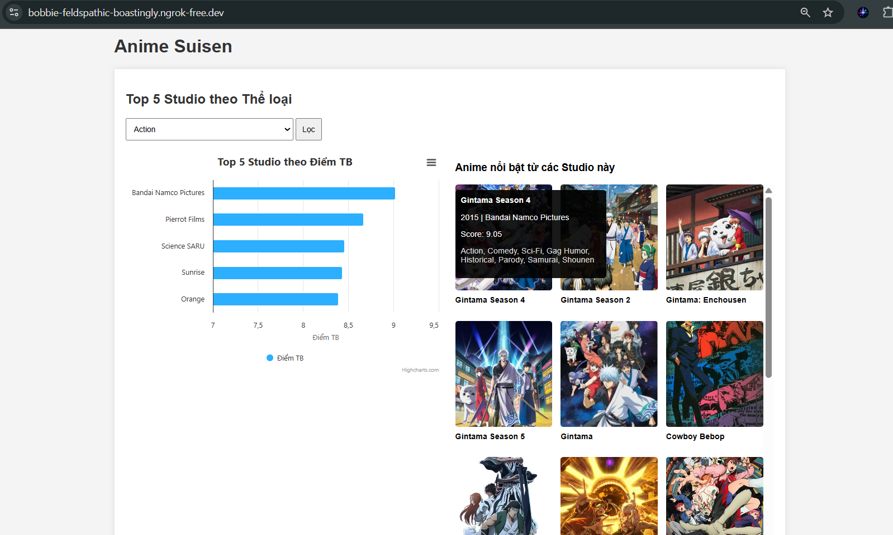
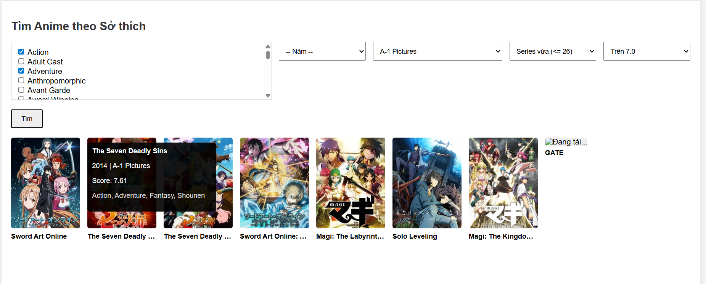
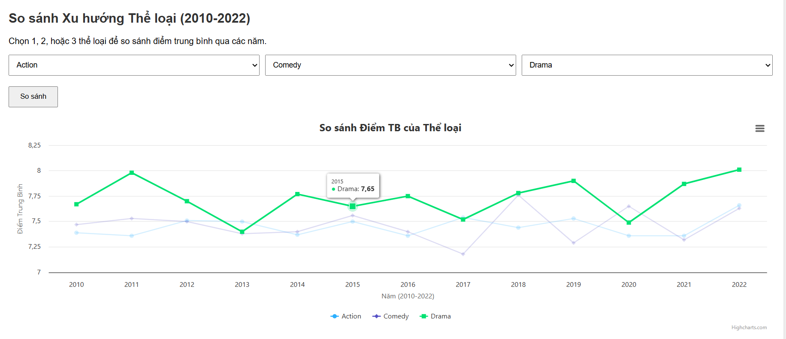
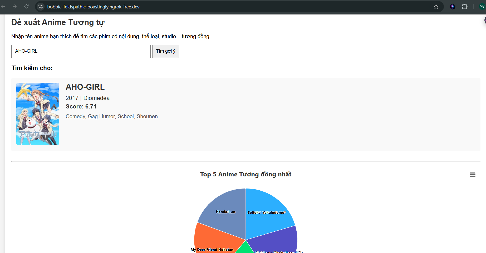
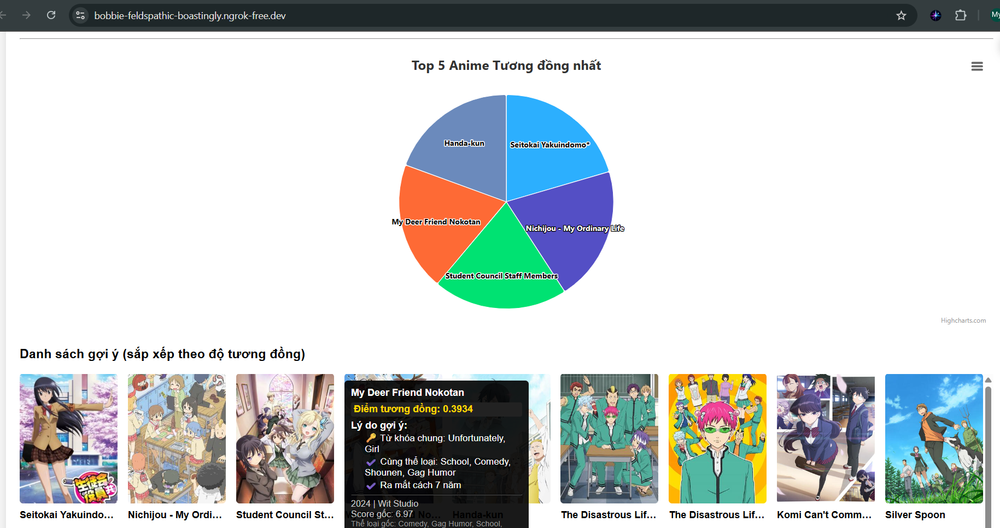

# Anime Suisen 🎌

**Anime Suisen** là một ứng dụng web phân tích và gợi ý anime thông minh, sử dụng Machine Learning (NLP) và phân tích dữ liệu để giúp người dùng khám phá anime phù hợp với sở thích của mình.

🔗 **Demo**: [https://bobbie-feldspathic-boastingly.ngrok-free.dev/](https://bobbie-feldspathic-boastingly.ngrok-free.dev/)

---

## 📋 Mục lục

- [Tính năng](#-tính-năng)
- [Công nghệ sử dụng](#-công-nghệ-sử-dụng)
- [Cài đặt](#-cài-đặt)
- [Sử dụng](#-sử-dụng)
- [Cấu trúc dự án](#-cấu-trúc-dự-án)
- [API Endpoints](#-api-endpoints)
- [Thuật toán gợi ý](#-thuật-toán-gợi-ý)

---

## ✨ Tính năng

### 🎯 Tính năng 1: Top 5 Studio theo Thể loại
- Hiển thị biểu đồ cột (bar chart) các studio có điểm trung bình cao nhất
- Lọc theo thể loại anime
- Hiển thị grid 10 anime nổi bật từ các studio này
- Tích hợp ảnh từ Kitsu API

### 🔍 Tính năng 2: Tìm kiếm Anime theo Sở thích
- Tìm kiếm đa tiêu chí:
  - Thể loại (hỗ trợ chọn nhiều - logic AND)
  - Năm phát hành
  - Studio sản xuất
  - Số tập (Movie/Series ngắn/vừa)
  - Điểm đánh giá tối thiểu
- Hiển thị tối đa 50 kết quả, sắp xếp theo độ phổ biến
- Tích hợp ảnh từ Jikan API

### 📈 Tính năng 3: So sánh Xu hướng Thể loại
- Biểu đồ đường (line chart) so sánh điểm trung bình của 1-3 thể loại
- Phạm vi thời gian: 2010-2022
- Tính năng bật/tắt từng chuỗi dữ liệu trên biểu đồ
- Phát hiện xu hướng thay đổi theo thời gian

### 🤖 Tính năng 4: Gợi ý Anime Tương đồng (NLP)
- Sử dụng thuật toán TF-IDF và Cosine Similarity để phân tích nội dung
- Tính toán điểm tương đồng dựa trên 4 yếu tố:
  - **NLP Score** (50%): Phân tích cốt truyện/bối cảnh
  - **Genre Score** (30%): Độ tương đồng thể loại (Jaccard)
  - **Studio Score** (10%): Cùng studio sản xuất
  - **Year Score** (10%): Gần nhau về năm phát hành
- Hiển thị:
  - Biểu đồ tròn (pie chart) top 5 gợi ý
  - Grid 50 anime tương đồng với lý do chi tiết
  - Trích xuất từ khóa chung quan trọng

---

## 📸 Demo / Screenshots

### 🎬 Demo trực tiếp
🔗 **[Truy cập Demo](https://bobbie-feldspathic-boastingly.ngrok-free.dev/)**

---

### 🎯 Tính năng 1: Top 5 Studio theo Thể loại

*Biểu đồ cột hiển thị các studio có điểm trung bình cao nhất, kèm grid anime nổi bật*

---

### 🔍 Tính năng 2: Tìm kiếm Anime theo Sở thích

*Lọc anime theo nhiều tiêu chí: thể loại, năm, studio, số tập, rating*

---

### 📈 Tính năng 3: So sánh Xu hướng Thể loại

*Biểu đồ đường so sánh điểm trung bình của các thể loại từ 2010-2022*

---

### 🤖 Tính năng 4: Gợi ý Anime Tương đồng (NLP)
*Sử dụng Machine Learning để phân tích nội dung và đề xuất anime tương đồng với lý do chi tiết*
<p float="left">
  
  
</p>

---

## 🛠️ Công nghệ sử dụng

### Backend
- **Python**
- **Flask** - Web framework
- **Pandas** - Xử lý và phân tích dữ liệu
- **Scikit-learn** - Machine Learning (TF-IDF, Cosine Similarity)
- **NumPy** - Tính toán số học

### Frontend
- **HTML5/CSS3/JavaScript**
- **Highcharts** - Thư viện biểu đồ tương tác
- **Kitsu API** - Lấy ảnh anime (Features 1, 4)
- **Jikan API** - Lấy ảnh anime (Feature 2)

### Dữ liệu
- Dataset: `anime_dataset.csv` (chứa 2,000+ anime với đầy đủ metadata)

---

## 📦 Cài đặt

### 1. Clone repository

```bash
git clone https://github.com/myanh5654/anime-dashboard.git
cd anime-dashboard
```

### 2. Tạo môi trường ảo (khuyến nghị)

```bash
python -m venv venv

# Windows
venv\Scripts\activate

# Linux/Mac
source venv/bin/activate
```

### 3. Cài đặt dependencies

```bash
pip install -r requirements.txt
```

---

## 🚀 Sử dụng

### Chạy server

```bash
python app.py
```

Server sẽ chạy tại: `http://localhost:8080`

### Truy cập ứng dụng

Mở trình duyệt và truy cập: `http://localhost:8080`

---

## 🔌 API Endpoints

### Feature 1
- `GET /api/genres` - Lấy danh sách thể loại
- `GET /api/top_studios?genre={genre}` - Top 5 studio theo thể loại

### Feature 2
- `GET /api/all_filters` - Lấy tất cả bộ lọc (genres, years, studios)
- `GET /api/filter?genres={}&year={}&studio={}&max_episodes={}&min_score={}` - Tìm kiếm anime

### Feature 3
- `GET /api/genre_trends?genres={genre1,genre2,genre3}` - Dữ liệu xu hướng thể loại

### Feature 4
- `GET /api/all_titles` - Lấy danh sách tên anime
- `GET /api/recommend?title={anime_name}` - Gợi ý anime tương đồng

---

## 🧠 Thuật toán gợi ý

### Công thức tính điểm tương đồng:

```
Final_Score = (Score_NLP × 0.5) + (Score_Genre × 0.3) + (Score_Studio × 0.1) + (Score_Year × 0.1)
```

### Chi tiết các thành phần:

1. **Score_NLP** (0-1): Cosine Similarity giữa 2 vector TF-IDF của tóm tắt
2. **Score_Genre** (0-1): Jaccard Similarity của tập thể loại
3. **Score_Studio** (0 hoặc 1): Có cùng studio hay không
4. **Score_Year** (0-1): Normalized distance giữa năm phát hành

### Trích xuất lý do:
- Top 3 từ khóa chung quan trọng nhất (từ vector TF-IDF)
- Thể loại trùng khớp
- Studio chung
- Khoảng cách năm

---

## ⚠️ Lưu ý

### Rate Limiting API bên thứ 3
- **Kitsu API**: Sleep 300ms giữa mỗi request
- **Jikan API**: Sleep 1200ms giữa mỗi request (nghiêm ngặt hơn)

### Performance
- Feature 4 tính toán NLP cho toàn bộ dataset → Có thể mất vài giây
- Ma trận TF-IDF được tính toán trước khi server khởi động

---

## 📄 Dependencies (requirements.txt)

```txt
Flask==3.1.2
flask-cors==6.0.1
pandas==2.3.3
scikit-learn==1.7.2
numpy==2.2.6
python-dotenv==1.2.1
```
---

## 👨‍💻 Tác giả

Dự án được phát triển như một công cụ phân tích và gợi ý anime thông minh phục vụ môn học Python for Everyone (Py4E)

---

## 📝 License

[MIT License](LICENSE) - Tự do sử dụng và chỉnh sửa.

---

**Chúc bạn khám phá được những bộ anime yêu thích! 🎬✨**
